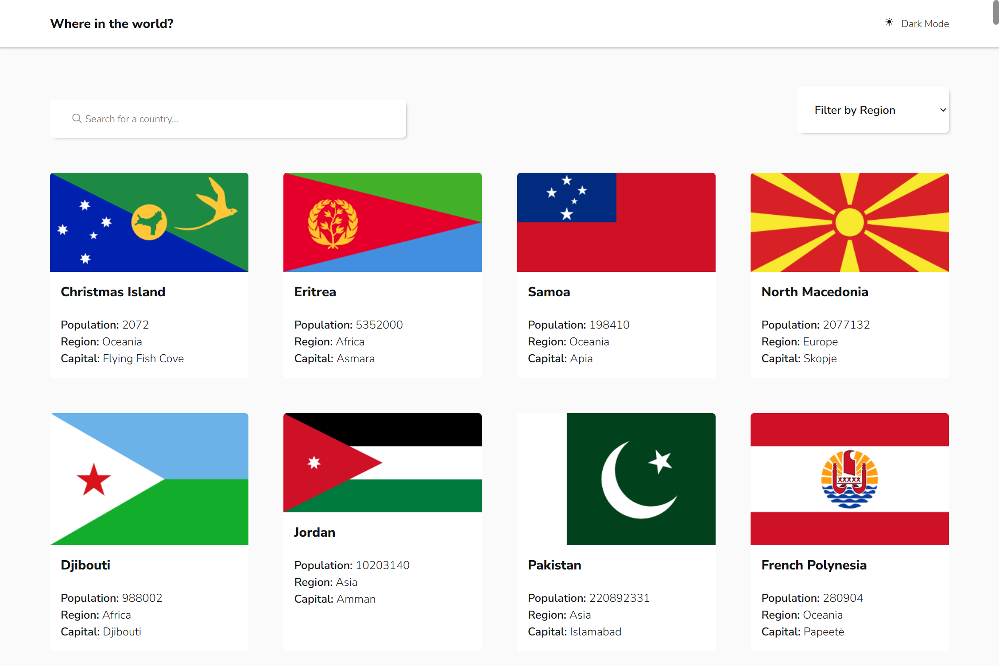
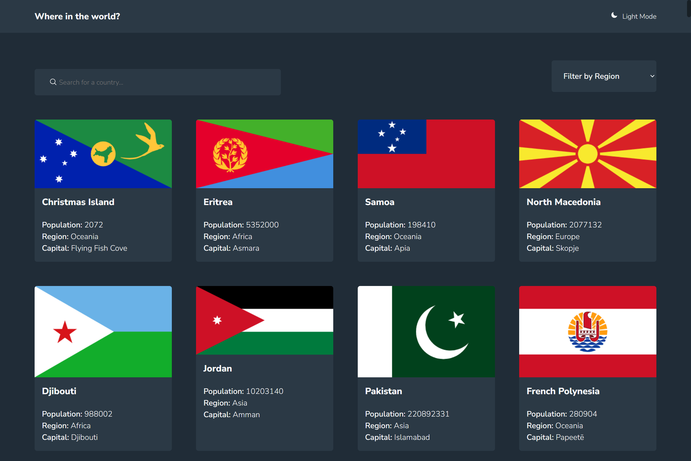
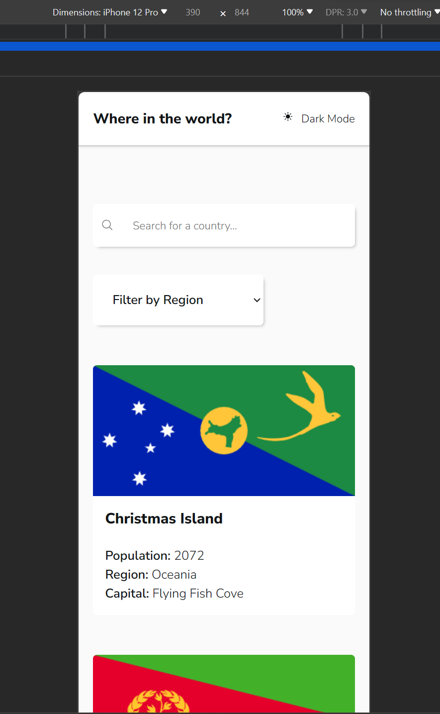
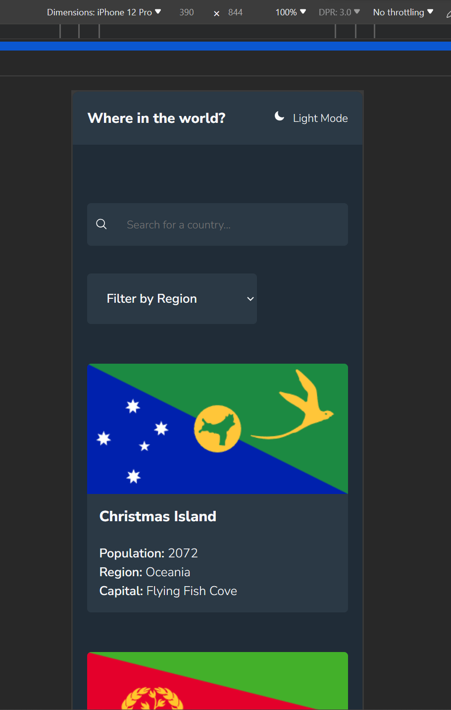

# Frontend Mentor - REST Countries API with color theme switcher solution

This is a solution to the [REST Countries API with color theme switcher challenge on Frontend Mentor](https://www.frontendmentor.io/challenges/rest-countries-api-with-color-theme-switcher-5cacc469fec04111f7b848ca). Frontend Mentor challenges help you improve your coding skills by building realistic projects.

## Table of contents

- [Frontend Mentor - REST Countries API with color theme switcher solution](#frontend-mentor---rest-countries-api-with-color-theme-switcher-solution)
  - [Table of contents](#table-of-contents)
  - [Overview](#overview)
    - [The challenge](#the-challenge)
    - [Screenshot](#screenshot)
    - [Links](#links)
  - [My process](#my-process)
    - [Built with](#built-with)
    - [What I learned](#what-i-learned)
    - [Continued development](#continued-development)
    - [Useful resources](#useful-resources)
  - [Author](#author)
  - [Acknowledgments](#acknowledgments)

## Overview

### The challenge

Users should be able to:

- See all countries from the API on the homepage
- Search for a country using an `input` field
- Filter countries by region
- Click on a country to see more detailed information on a separate page
- Click through to the border countries on the detail page
- Toggle the color scheme between light and dark mode _(optional)_

### Screenshot






### Links

- Solution URL: [Add solution URL here](https://github.com/Zeuhz-Droid/rest_countries_with_apis)
- Live Site URL: [Add live site URL here](https://Zeuhz-Droid.github.io/rest_countries_with_apis)

## My process

### Built with

- Semantic HTML5 markup
- CSS custom properties
- Flexbox
- CSS Grid
- Mobile-first workflow
- [React](https://reactjs.org/) - JS library
- [Styled Components](https://styled-components.com/) - For styles

### What I learned

- I got more familiar with react-router-dom
- hooks and url data saving

```js
const router = createBrowserRouter([
  {
    element: <AppLayout />,

    children: [
      {
        path: "/:query?",
        element: <Countries />,
        loader: countriesLoader,
        errorElement: <p>Error...</p>,
      },
      {
        path: "/country/:countryName?",
        element: <CountryDetail />,
        loader: countryDetailLoader,
        errorElement: <p>This one no work.</p>,
      },
    ],
  },
]);
```

### Continued development

- Redux Toolkit
- React Query/transack etc

### Useful resources

- [Resource 1](https://heroicons.com/) - This helped me with leveraging react-icons from hero-icons. I really liked this pattern and will use it going forward.
- [Resource 2](https://gitlab.com/restcountries/restcountries/-/blob/master/FIELDS.md) - This is an amazing article which helped me understand how the API was documented. I'd recommend it to anyone still learning this concept.

## Author

- Website - [Zeuhz Droid](https://www.linkedin.com/in/zeuhz)
- Frontend Mentor - [@yourusername](https://www.frontendmentor.io/profile/Zeuhz-Droid)
- Twitter - [@yourusername](https://www.twitter.com/yourusername)

## Acknowledgments

Contributor &ndash; Zeuhz Droid.
